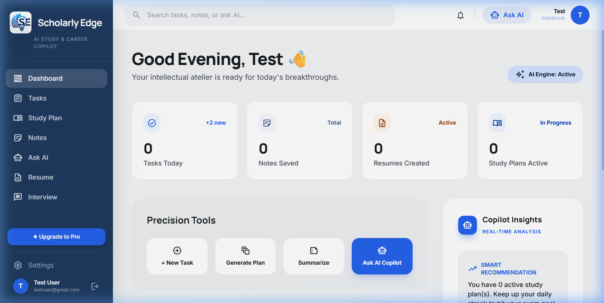
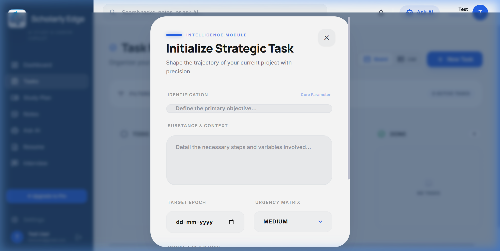
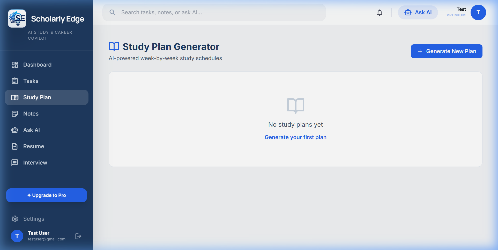
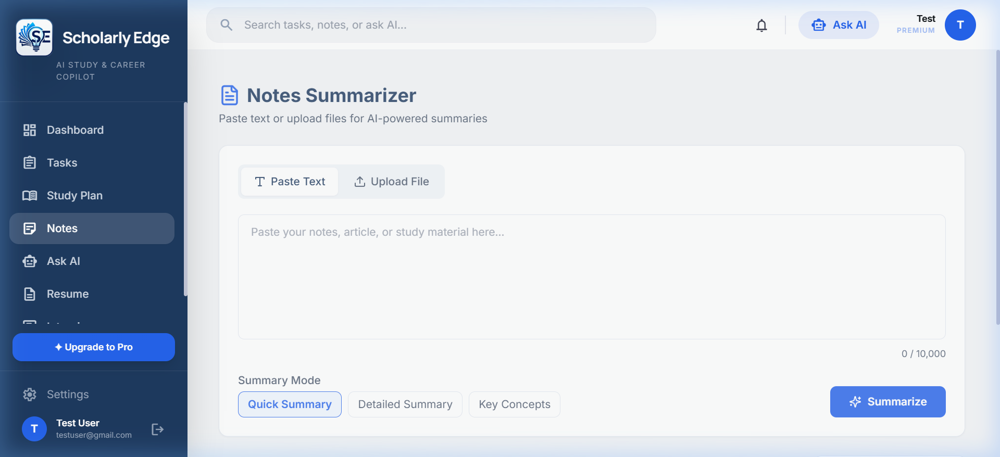
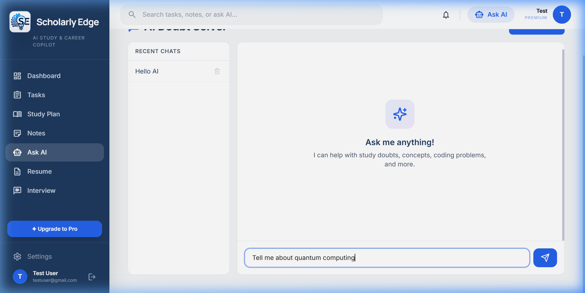
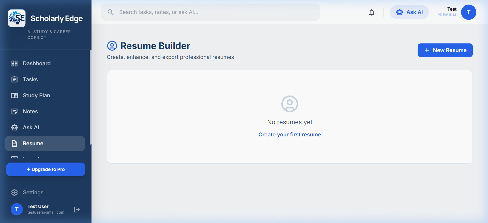
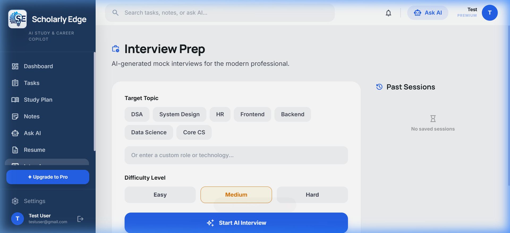
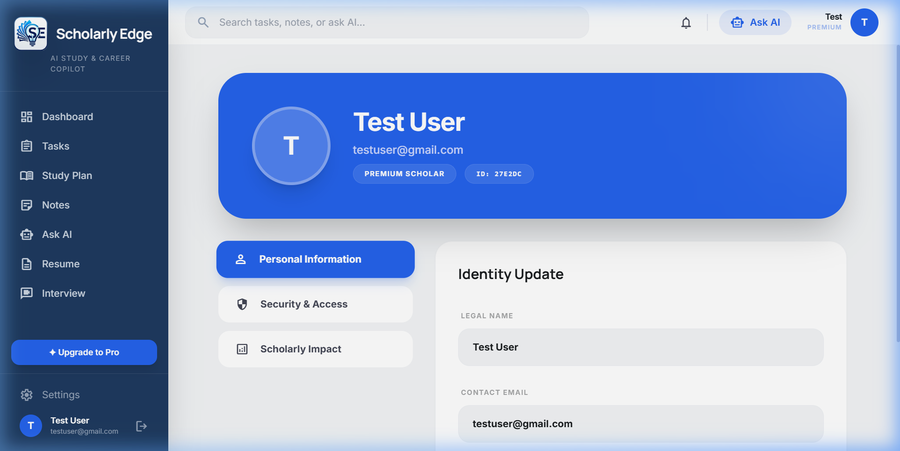
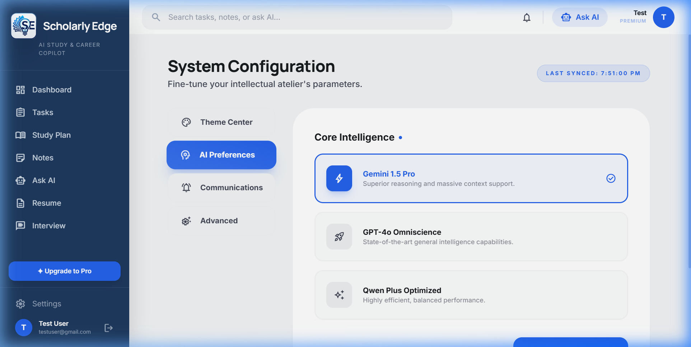

# 🎓 Scholarly Edge — AI Study & Career Copilot

<div align="center">



[](https://ai-study-career-copilot.vercel.app)
[](https://github.com/dineshmanore/AI-Study-Career-Copilot)
[](https://nodejs.org)
[](https://reactjs.org)
[](https://mongodb.com)

**An all-in-one AI-powered workspace for students and early-career professionals.**

[🌐 Live App](https://ai-study-career-copilot.vercel.app) · [🐛 Report Bug](https://github.com/dineshmanore/AI-Study-Career-Copilot/issues) · [✨ Request Feature](https://github.com/dineshmanore/AI-Study-Career-Copilot/issues)

</div>

---

## 📖 About The Project

**Scholarly Edge** is a full-stack MERN application that serves as an all-in-one academic and career intelligence platform. It leverages state-of-the-art AI language models (via OpenRouter) to provide real-time, context-aware assistance for students — from planning study sessions to preparing for job interviews.

### ✨ Key Features

| Module | Description |
|---|---|
| 📊 **Smart Dashboard** | Bento-grid statistics tracking tasks, study streaks & progress |
| ✅ **Task Manager** | Strategic Kanban/List view with AI-powered initiative management |
| 📚 **AI Study Planner** | Generates personalized day/week study tracks based on exam dates |
| 📝 **Notes Summarizer** | Converts lecture notes into structured bullet-point summaries |
| 🤖 **Ask AI (Chat)** | Real-time streaming AI tutor for study doubts and concept explanations |
| 📄 **ATS Resume Builder** | Builds and grades resumes with ATS score + improvement tips |
| 🎙️ **Interview Simulator** | AI-powered mock interview Q&A with answer evaluation & feedback |
| 👤 **Profile Hub** | Centralized identity, security & scholarly impact management |
| ⚙️ **System Settings** | Theme (Dark/Light), AI model selection, and notification controls |

---

## 🖼️ Screenshots

<details>
<summary><b>Click to expand all screenshots</b></summary>

### Dashboard


### Task Manager


### AI Study Planner


### Notes Hub


### Ask AI (Chat)


### Resume Builder


### Interview Simulator


### Profile


### Settings


</details>

---

## 🛠️ Tech Stack

**Frontend**
- ⚛️ React 18 + Vite
- 🎨 Tailwind CSS (custom design system + dark mode)
- 🔗 React Router v6
- 📡 Axios (with auth interceptor)

**Backend**
- 🟢 Node.js + Express.js
- 🍃 MongoDB + Mongoose
- 🔐 JWT Authentication (httpOnly cookies)
- 📄 Multer (PDF/DOCX upload)
- 📡 Server-Sent Events (AI streaming)

**AI / Integrations**
- 🤖 OpenRouter API (Qwen, Gemini, GPT-4o models)
- 📊 PDF-parse (resume & note document parsing)

**Deployment**
- ▲ Vercel (Frontend)
- 🟢 Railway / Render (Backend)
- 🍃 MongoDB Atlas (Database)

---

## 🚀 Getting Started

### Prerequisites
- Node.js 18+
- npm or yarn
- MongoDB Atlas account
- OpenRouter API key

### Installation

**1. Clone the repository**
```bash
git clone https://github.com/dineshmanore/AI-Study-Career-Copilot.git
cd AI-Study-Career-Copilot
```

**2. Setup the backend**
```bash
cd server
npm install
```

Create a `.env` file in `/server`:
```env
MONGO_URI=your_mongodb_atlas_uri
JWT_SECRET=your_jwt_secret
OPENROUTER_API_KEY=your_openrouter_key
CLIENT_URL=http://localhost:5173
```

Start the server:
```bash
npm run dev
```

**3. Setup the frontend**
```bash
cd client
npm install
```

Create a `.env` file in `/client`:
```env
VITE_API_URL=http://localhost:5000/api
```

Start the frontend:
```bash
npm run dev
```

**4. Open the app**

Visit `http://localhost:5173` in your browser.

---

## 📁 Project Structure

```
AI-Study-Career-Copilot/
├── client/                 # React Frontend
│   ├── src/
│   │   ├── components/     # Layout, Markdown, etc.
│   │   ├── context/        # Auth Context
│   │   ├── pages/          # All page components
│   │   └── utils/          # Axios instance
│   └── public/             # Static assets
└── server/                 # Express Backend
    ├── middleware/          # Auth verification
    ├── models/             # Mongoose schemas
    ├── routes/             # API route handlers
    └── utils/              # OpenRouter helper
```

---

## 🌐 Deployment

| Service | URL |
|---|---|
| **Live App** | https://ai-study-career-copilot.vercel.app |
| **GitHub** | https://github.com/dineshmanore/AI-Study-Career-Copilot |

---

## 👤 Author

**Dinesh Manore** — Roll No: SA117

---

## 📄 License

This project is academic in nature and submitted as coursework.
